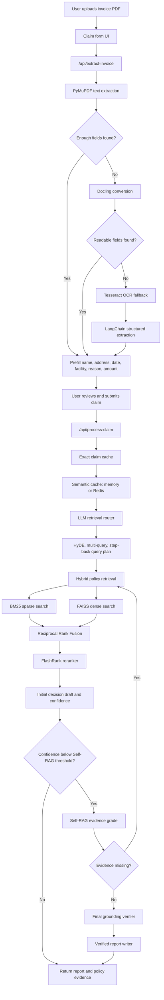

<div align="center">

# 🏥 AI Claims Processing System

**An intelligent, evidence-driven insurance claim adjudication platform**

[](https://python.org)
[](https://fastapi.tiangolo.com)
[](https://langchain.com)
[](https://docker.com)
[](LICENSE)

[**▶ Watch Demo**](https://www.loom.com/share/802c0e92627c4974ad695998c72634f9) · [Report Bug](issues) · [Request Feature](issues)

</div>

---

## The Problem

Health insurance claim processing is slow, repetitive, and document-heavy. Traditional workflows require claim reviewers to:

- Manually inspect hospital invoices and extract billing details
- Search through lengthy, complex policy documents
- Cross-verify treatment codes, exclusions, and coverage conditions
- Justify every approval or rejection decision — consistently, at scale

This is costly, error-prone, and creates long turnaround times for patients and providers alike.

---

## The Solution

The **AI Claims Processing System** automates the first-pass claim review workflow through a **multi-stage evidence verification pipeline** — not a simple document Q&A bot.

Rather than relying on a single retrieval step, the system performs **multiple evidence validation passes**, cross-checking treatments, billing details, exclusions, and coverage rules before producing a structured verdict. When evidence is weak or conflicting, the system escalates to a human reviewer rather than generating an unreliable decision.

Built with **FastAPI, LangChain, FAISS, FlashRank, OCR pipelines, intelligent caching, and optional Redis semantic caching**, the platform significantly reduces manual effort and accelerates claim assessment while maintaining decision reliability and human oversight.

---

## Key Impact

| | Manual Process | AI-Assisted |
|---|---|---|
| First-pass review time | Days – weeks | Minutes |
| Decision consistency | Variable | Evidence-backed |
| Reviewer workload | Full document analysis | Escalated edge cases only |
| Audit trail | Manual notes | Structured, auto-generated |

- ✅ Automates first-pass insurance claim review
- ✅ Reduces manual document analysis time
- ✅ Improves decision consistency through evidence-backed validation
- ✅ Adds human-in-the-loop escalation for uncertain cases

---

## Highlights

### Document Extraction
- PDF invoice extraction with a fast **PyMuPDF** text path
- **Docling**, **Tesseract OCR**, and **LangChain structured extraction** fallbacks for harder documents
- HTML/CSS/JavaScript claim form for user review of extracted fields before submission

### Retrieval Architecture
- **LLM retrieval routing** with query rewrite, HyDE, multi-query expansion, and step-back questions
- **Hybrid retrieval** over policy chunks:
  - Dense retrieval with FAISS and Hugging Face embeddings
  - Sparse retrieval with BM25
  - Reciprocal Rank Fusion to merge result lists
- **FlashRank cross-encoder reranking** before adjudication

### Decision & Verification
- **Confidence-gated Self-RAG loop** with evidence grading, re-retrieval, grounding checks, contradiction checks, and hallucination-risk checks
- Human-in-the-loop escalation for low-confidence or conflicting cases

### Caching
- Upload-field cache (by file hash)
- Exact decision cache (by claim + policy version)
- Semantic in-memory cache for similar repeat claims
- Optional **Redis semantic cache** for cross-request reuse

### Reporting
- Structured report sections: executive summary, claim details, document verification, policy evidence, and conclusion

---

## Tech Stack

### API & Backend

| Tool | Role |
|---|---|
| **FastAPI** | High-performance REST framework powering all endpoints — invoice extraction, claim processing, and health checks |
| **Uvicorn** | ASGI server that runs the FastAPI app in both development and Docker environments |
| **Pydantic** | Data validation and typed schema definitions for all API request and response models |

### LLM Orchestration

| Tool | Role |
|---|---|
| **LangChain** | Orchestrates the full RAG pipeline — query rewriting, HyDE generation, multi-query expansion, and structured LLM extraction |
| **Groq / OpenAI** | Pluggable LLM providers. Groq runs `llama-3.3-70b-versatile` for fast inference; OpenAI is the alternative backend |
| **Self-RAG loop** | Custom confidence-gated verification pipeline — grades evidence, checks grounding, detects contradictions, and triggers re-retrieval up to 3 iterations |

### Retrieval & Vector Search

| Tool | Role |
|---|---|
| **FAISS** | Dense vector similarity search over chunked policy documents. Finds semantically relevant policy clauses at speed |
| **BM25** | Sparse keyword-based retrieval that captures exact policy terms, billing codes, and condition names embeddings may miss |
| **Reciprocal Rank Fusion** | Merges BM25 and FAISS result lists into a single unified ranked list before reranking |
| **Hugging Face Embeddings** | Uses `sentence-transformers/all-MiniLM-L6-v2` to embed policy chunks and claim queries for dense retrieval |

### Reranking

| Tool | Role |
|---|---|
| **FlashRank** | Lightweight cross-encoder reranker that re-scores retrieved policy passages by relevance before adjudication — significantly improves evidence precision |

### OCR & Document Extraction

| Tool | Role |
|---|---|
| **PyMuPDF** | Primary PDF text extractor. Used first because it is significantly faster than OCR for text-based invoices |
| **Docling** | Fallback document parser for structured extraction when PyMuPDF cannot find sufficient fields |
| **Tesseract OCR** | Final fallback for scanned or image-based invoices. Included in the Docker image; optional for local text-PDF workflows |

### Caching

| Layer | Role |
|---|---|
| **Upload field cache** | Caches extracted invoice fields by file hash so the claim endpoint reuses prefill data without re-parsing |
| **Exact decision cache** | Caches full adjudication results keyed by claim data, policy version, and schema version |
| **Semantic in-memory cache** | Matches semantically similar claims using embedded query comparison, avoiding redundant LLM calls within a session |
| **Redis** *(optional)* | Persistent semantic cache across app restarts and instances. Activated when `REDIS_URL` is set |

### Frontend & Infrastructure

| Tool | Role |
|---|---|
| **HTML / CSS / JavaScript** | Vanilla frontend — renders the claim form, prefills extracted fields, and displays the adjudication report |
| **Docker** | Full containerisation with Tesseract included. Supports standalone or Redis-networked deployment |
| **Python 3.11** | Recommended runtime, fully compatible with all dependencies |

---

## Architecture



---

## End-To-End Pipeline

1. **Invoice upload and extraction**
   - `POST /api/extract-invoice` reads the uploaded PDF
   - Text PDFs use PyMuPDF first (faster than OCR)
   - Falls back to Docling → Tesseract OCR → LangChain structured extraction as needed

2. **Claim review UI**
   - Browser prefills patient name, address, treatment date, facility, diagnosis, and payable amount
   - User can correct any field before adjudication

3. **Claim normalization and validation**
   - `POST /api/process-claim` builds a normalized claim object
   - Flags missing fields, impossible dates, amount mismatches, and out-of-region addresses

4. **Cache lookup**
   - File hash cache reuses extracted fields from the prefill step
   - Exact cache keys include claim data, policy version, and schema version
   - Semantic cache compares embedded claim queries for repeat submissions

5. **LLM retrieval routing**
   - LLM generates a retrieval plan: rewritten queries, HyDE passage, step-back question, required policy topics

6. **Advanced retrieval**
   - BM25 (sparse) + FAISS (dense) search over policy chunks
   - Reciprocal Rank Fusion merges rankings
   - FlashRank cross-encoder reranks final candidate passages

7. **Decision and Self-RAG**
   - First draft produces a report and confidence score
   - High-confidence → fast return path
   - Low-confidence → Self-RAG loop (evidence grading, grounding, contradiction, hallucination checks, re-retrieval up to 3 iterations)

8. **Report response**
   - Returns decision report, policy citations, cache status, and pipeline trace

---

## Project Layout

```text
.
├── app/
│   ├── main.py                  # FastAPI app and API endpoints
│   └── services/
│       ├── cache.py             # LRU, semantic, and Redis semantic caches
│       ├── claims.py            # Decision engine and Self-RAG orchestration
│       ├── llm.py               # LangChain prompts and LLM provider setup
│       ├── ocr.py               # PDF extraction and OCR fallbacks
│       ├── rag.py               # Policy loading, hybrid retrieval, RRF, reranking
│       └── schemas.py           # Pydantic request and response models
├── data/policies/bupa.pdf       # Policy guide knowledge base
├── frontend/                    # HTML/CSS/JavaScript UI
├── scripts/                     # Sample invoice PDF generators
├── Dockerfile
├── requirements.txt
└── README.md
```

---

## Requirements

- Python 3.11 (recommended)
- A Groq API key **or** OpenAI API key
- Tesseract — only needed locally for scanned/image invoices (included in Docker image)
- Redis — optional, for cross-request semantic caching

Text-based PDFs can be extracted without Tesseract.

---

## Configuration

Copy `.env.example` to `.env` and set your provider key:

```env
CLAIMS_LLM_PROVIDER=groq
CLAIMS_LLM_MODEL=llama-3.3-70b-versatile
GROQ_API_KEY=replace_with_your_groq_api_key
REDIS_URL=redis://localhost:6379/0
SELF_RAG_CONFIDENCE_THRESHOLD=0.75
```

| Variable | Purpose | Example |
|---|---|---|
| `CLAIMS_LLM_PROVIDER` | LLM provider | `groq` or `openai` |
| `CLAIMS_LLM_MODEL` | Model name for LangChain | `llama-3.3-70b-versatile` |
| `GROQ_API_KEY` | Groq key (if provider is Groq) | `gsk_...` |
| `OPENAI_API_KEY` | OpenAI key (if provider is OpenAI) | `sk-...` |
| `REDIS_URL` | Optional Redis semantic cache | `redis://localhost:6379/0` |
| `SELF_RAG_CONFIDENCE_THRESHOLD` | Confidence below which Self-RAG runs | `0.75` |

If `CLAIMS_LLM_PROVIDER` is omitted, the backend infers it from whichever API key is present.

---

## Local Setup (Windows)

```powershell
# Create and activate virtual environment
python -m venv insurance
.\insurance\Scripts\Activate.ps1

# Install dependencies
python -m pip install --upgrade pip
pip install -r requirements.txt

# Copy and edit environment config
Copy-Item .env.example .env

# Run the app
python -m uvicorn app.main:app --reload --host 127.0.0.1 --port 8000
```

Open `http://127.0.0.1:8000` in your browser.

> If port 8000 is in use, add `--port 8001` to the uvicorn command.

---

## Docker

```powershell
# Build
docker build -t ai-claims-processing .

# Run
docker run --rm --name ai-claims-processing -p 8000:8000 --env-file .env ai-claims-processing
```

### With Redis

```powershell
docker network create claims-net
docker run -d --name claims-redis --network claims-net redis:7

docker run --rm --name ai-claims-processing \
  --network claims-net -p 8000:8000 --env-file .env \
  -e REDIS_URL=redis://claims-redis:6379/0 \
  ai-claims-processing
```

---

## API Reference

| Method | Endpoint | Purpose |
|---|---|---|
| `GET` | `/` | Serve the claims UI |
| `GET` | `/api/health` | Health check |
| `POST` | `/api/extract-invoice` | Extract invoice fields from uploaded PDF |
| `POST` | `/api/process-claim` | Process claim and return adjudication report |

Full interactive docs at `http://localhost:8000/docs`.

---

## Policy Data

The RAG index is built from `data/policies/bupa.pdf`. To update:

1. Replace the PDF in `data/policies/`
2. Restart the backend (policy version change refreshes the chunk cache)
3. Rebuild the Docker image if the updated PDF should be baked in

For Docker dev, mount the policy directory instead of rebuilding:

```powershell
docker run --rm -p 8000:8000 --env-file .env \
  -v ${PWD}\data\policies:/app/data/policies:ro \
  ai-claims-processing
```

---

## Performance Notes

- **Fast path:** text PDFs with all required fields return prefill data directly from PyMuPDF — very fast
- **Slow path:** Docling, OCR, and LLM extraction are heavier; expect longer latency for scanned or irregular invoices
- **First run warm-up:** Hugging Face embedding and reranking models may need to download on first retrieval
- **Self-RAG cost:** low-confidence claims make extra LLM calls; raise `SELF_RAG_CONFIDENCE_THRESHOLD` for more caution, lower it to favour speed
- **Rate limits:** Groq/OpenAI quota limits can delay responses; retry after reset or choose an appropriate tier

---

## License

MIT License — see [LICENSE](LICENSE) for details.

---

## Contributing

Pull requests are welcome. For major changes, please open an issue first to discuss what you'd like to change.

<div align="center">

Built with FastAPI · LangChain · FAISS · FlashRank · Tesseract · Redis

</div>
