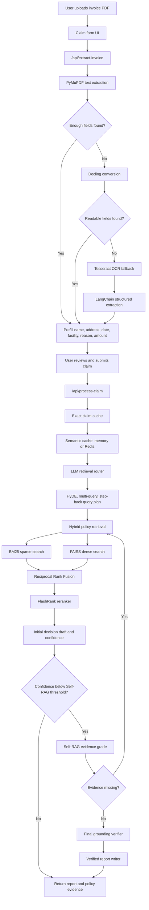

# AI Claims Processing System

# AI Claims Processing System

Health insurance claim processing is often a slow and document-intensive workflow that requires reviewing medical invoices, validating claim details, interpreting policy documents, and making consistent decisions under uncertainty.AI Claims Processing System is an AI-powered claims adjudication assistant designed to streamline this process. Users can upload hospital invoices, review automatically extracted claim information, and receive a structured claim decision supported by relevant policy evidence.The system combines FastAPI for backend services, modern frontend interfaces for user interaction, OCR-based document extraction for invoice understanding, and an advanced retrieval-augmented generation (RAG) pipeline with hybrid search, reranking, and self-verification to improve decision reliability. To optimize performance and repeated workflows, the architecture also incorporates intelligent caching and optional Redis-based semantic caching.

This project demonstrates how modern AI systems can reduce manual operational effort, improve consistency, and accelerate first-pass insurance claim assessment while preserving human oversight for uncertain cases.

## Problem Statement

Health insurance claim review is slow and error-prone when staff must manually read hospital invoices, re-enter claim details, search long policy documents, and explain why a claim is approved, rejected, or sent for review.

## What This Project Solves

This project automates the first-pass claims workflow. It extracts key data from uploaded hospital invoices, lets the user verify the extracted details, retrieves relevant policy evidence with advanced RAG, and generates a structured claim report with a policy-grounded decision or a human-review outcome when evidence is uncertain.

## Highlights

- PDF invoice extraction with a fast PyMuPDF text path.
- Docling, Tesseract OCR, and LangChain structured extraction fallbacks for harder documents.
- HTML/CSS/JavaScript claim form that lets the user review extracted fields before submission.
- LLM retrieval routing with query rewrite, HyDE, multi-query expansion, and step-back questions.
- Hybrid retrieval over policy chunks:
  - Dense retrieval with FAISS and Hugging Face embeddings.
  - Sparse retrieval with BM25.
  - Reciprocal Rank Fusion to merge result lists.
- FlashRank cross-encoder reranking before adjudication.
- Confidence-gated Self-RAG loop with evidence grading, re-retrieval, grounding checks, contradiction checks, and hallucination-risk checks.
- Upload-field cache, exact decision cache, semantic in-memory cache, optional Redis semantic cache, and a policy document chunk cache.
- Report UI sections for executive summary, introduction, claim details, document verification, document summary, conclusion, and policy evidence.

## Architecture



## End-To-End Pipeline

1. **Invoice upload and extraction**
   - `POST /api/extract-invoice` reads the uploaded PDF.
   - Text PDFs use PyMuPDF first because it is much faster than OCR.
   - If important prefill fields are missing, the extractor tries Docling. When readable text is still too thin, it uses Tesseract OCR; when parsed fields are still incomplete, it can use LangChain structured extraction.

2. **Claim review UI**
   - The browser fills patient name, address, treatment date, facility, diagnosis, and payable amount when extraction succeeds.
   - The user can correct any field before adjudication.

3. **Claim normalization and validation**
   - `POST /api/process-claim` builds a normalized claim object.
   - Validation flags catch missing fields, impossible dates, amount mismatches, and addresses that are not clearly within the UK.

4. **Cache lookup**
   - Extracted invoice fields are cached by uploaded file hash so the claim endpoint can reuse the fields already obtained during prefill.
   - Exact cache keys include claim data, policy version, and cache schema version.
   - Semantic cache compares embedded claim queries for repeat claims with a guard on patient, date, facility, amount, and policy version.
   - Redis semantic caching is enabled only when `REDIS_URL` is available.

5. **LLM retrieval routing**
   - LangChain asks the configured LLM to route the claim and create retrieval questions.
   - The retrieval plan includes rewritten queries, a HyDE passage, step-back question, required policy topics, and document checks.

6. **Advanced retrieval**
   - The Bupa PDF is split into policy chunks with page and section metadata.
   - BM25 retrieves keyword-heavy clauses.
   - FAISS retrieves semantically similar clauses using `sentence-transformers/all-MiniLM-L6-v2`.
   - Reciprocal Rank Fusion combines sparse and dense rankings.
   - FlashRank reranks the fused candidate chunks and selects policy evidence.

7. **Decision and Self-RAG**
   - The first decision draft writes the visible report sections and produces a confidence score.
   - High-confidence decisions return through a faster path.
   - Lower-confidence decisions trigger the Self-RAG loop for evidence relevance, sufficiency, grounding, contradiction, and hallucination-risk checks.
   - Missing evidence questions can trigger policy re-retrieval for up to three iterations.

8. **Report response**
   - The API returns the decision report, selected policy citations, cache status, and pipeline trace.
   - The UI renders the report in the centered claim-output layout.

## Project Layout

```text
.
|-- app/
|   |-- main.py                  # FastAPI app and API endpoints
|   `-- services/
|       |-- cache.py             # LRU, semantic, and Redis semantic caches
|       |-- claims.py            # Decision engine and Self-RAG orchestration
|       |-- llm.py               # LangChain prompts and LLM provider setup
|       |-- ocr.py               # PDF extraction and OCR fallbacks
|       |-- rag.py               # Policy loading, hybrid retrieval, RRF, reranking
|       `-- schemas.py           # Pydantic request and response models
|-- data/policies/bupa.pdf       # Policy guide knowledge base
|-- frontend/                    # HTML/CSS/JavaScript UI
|-- scripts/                     # Sample invoice PDF generators
|-- Dockerfile
|-- requirements.txt
`-- README.md
```

## Requirements

For local development:

- Python 3.11 is recommended.
- A Groq API key or OpenAI API key for claim processing.
- Tesseract installed locally only when scanned invoices need OCR.
- Redis is optional.

Text-based PDFs can be extracted without Tesseract. The Docker image includes Tesseract for OCR fallback.

## Configuration

Create `.env` from `.env.example` and set a real provider key.

```env
CLAIMS_LLM_PROVIDER=groq
CLAIMS_LLM_MODEL=llama-3.3-70b-versatile
GROQ_API_KEY=replace_with_your_groq_api_key
REDIS_URL=redis://localhost:6379/0
SELF_RAG_CONFIDENCE_THRESHOLD=0.75
```

Supported provider examples:

| Variable | Purpose | Example |
| --- | --- | --- |
| `CLAIMS_LLM_PROVIDER` | Claim LLM provider | `groq` or `openai` |
| `CLAIMS_LLM_MODEL` | Model used by LangChain | `llama-3.3-70b-versatile` |
| `GROQ_API_KEY` | Groq key when provider is Groq | `gsk_...` |
| `OPENAI_API_KEY` | OpenAI key when provider is OpenAI | `sk-...` |
| `REDIS_URL` | Optional Redis semantic cache | `redis://localhost:6379/0` |
| `SELF_RAG_CONFIDENCE_THRESHOLD` | Initial confidence below which Self-RAG runs | `0.75` |

If `CLAIMS_LLM_PROVIDER` is omitted, the backend tries to infer it from `OPENAI_API_KEY` or `GROQ_API_KEY`.

## Local Setup On Windows

Create and activate the virtual environment:

```powershell
python -m venv insurance
.\insurance\Scripts\Activate.ps1
```

Install dependencies:

```powershell
python -m pip install --upgrade pip
pip install -r requirements.txt
```

Copy environment defaults and edit the key:

```powershell
Copy-Item .env.example .env
```

Run the app:

```powershell
python -m uvicorn app.main:app --reload --host 127.0.0.1 --port 8000
```

Open:

```text
http://127.0.0.1:8000
```

If port `8000` is already in use, either stop the existing Uvicorn process or choose another port:

```powershell
python -m uvicorn app.main:app --reload --host 127.0.0.1 --port 8001
```

## Docker

Build the image:

```powershell
docker build -t ai-claims-processing .
```

Run it with the local `.env` file:

```powershell
docker run --rm --name ai-claims-processing -p 8000:8000 --env-file .env ai-claims-processing
```

Open:

```text
http://127.0.0.1:8000
```

### Docker With Redis

Create a small Docker network and start Redis:

```powershell
docker network create claims-net
docker run -d --name claims-redis --network claims-net redis:7
```

Run the app on the same network:

```powershell
docker run --rm --name ai-claims-processing --network claims-net -p 8000:8000 --env-file .env -e REDIS_URL=redis://claims-redis:6379/0 ai-claims-processing
```

Remove Redis when it is no longer needed:

```powershell
docker stop claims-redis
docker rm claims-redis
```

## Policy Data

The policy RAG index is created from:

```text
data/policies/bupa.pdf
```

To update the policy:

1. Replace `data/policies/bupa.pdf` with the desired PDF.
2. Restart the backend so the policy version changes and the document cache refreshes.
3. Rebuild the Docker image if the updated PDF should be baked into the image.

For Docker development, you can also mount the policy directory instead of rebuilding:

```powershell
docker run --rm -p 8000:8000 --env-file .env -v ${PWD}\data\policies:/app/data/policies:ro ai-claims-processing
```

The policy guide alone may not contain every member-specific allowance or special condition. The current app adjudicates against the uploaded claim details and the policy PDF supplied to the knowledge base.

## API Summary

| Method | Endpoint | Purpose |
| --- | --- | --- |
| `GET` | `/` | Serve the claims UI |
| `GET` | `/api/health` | Health check |
| `POST` | `/api/extract-invoice` | Extract invoice fields from an uploaded PDF |
| `POST` | `/api/process-claim` | Process claim form fields and optional invoice PDF |

## Sample Workflow

1. Open the claim form.
2. Upload a hospital invoice PDF.
3. Review the extracted patient and treatment fields.
4. Submit the claim.
5. Read the generated report and policy evidence.

The repository includes sample PDF generators under `scripts/` and sample PDFs in the workspace for manual testing.

## Performance Notes

- **Fast path:** text PDFs that contain patient, address, date, diagnosis, facility, and payable amount can return prefill fields directly from PyMuPDF parsing.
- **Slower extraction path:** Docling, OCR, and LLM structured extraction are heavier and may take noticeably longer for scanned or irregular PDFs.
- **First retrieval warm-up:** Hugging Face embedding and reranking model assets may need to initialize or download the first time retrieval runs in a fresh environment.
- **Self-RAG cost:** low-confidence cases may make extra LLM calls and re-retrieval passes. Raising `SELF_RAG_CONFIDENCE_THRESHOLD` increases caution; lowering it favors speed.
- **LLM limits:** Groq or OpenAI quota and rate limits can delay or fail a claim response. Retry after the provider limit resets or choose a model and tier that fit the workload.
- **Redis:** Redis helps repeated semantically similar claims across app requests when it is configured and available.

## Production Notes

This project is a claims-processing prototype. A production deployment should add:

- Authentication and authorization.
- Secure secret management instead of plain `.env` files.
- Encryption and retention controls for health and identity data.
- Audit logging for policy evidence, adjudication inputs, and human overrides.
- File type, file size, malware, and PDF safety controls.
- Provider monitoring, timeouts, retries, and rate-limit handling.
- A human-review workflow for uncertain, mixed, or high-risk claims.
